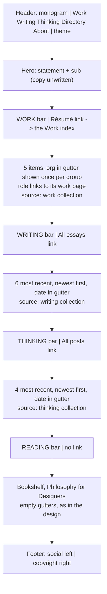
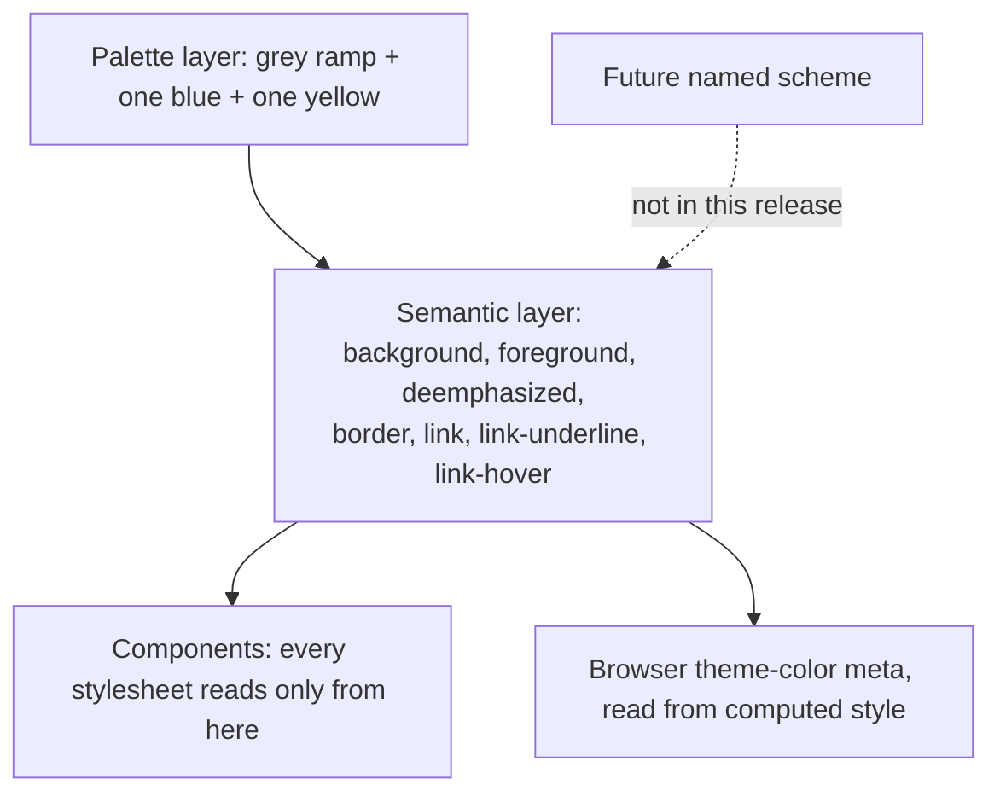
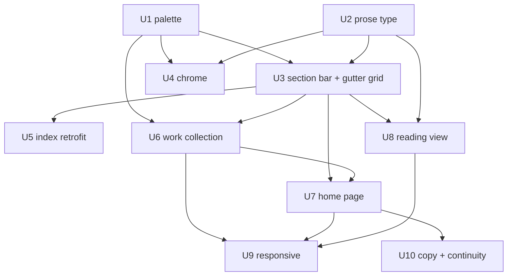

# Portfolio Redesign (Design H) - Plan

## Goal Capsule

- **Objective.** seanvoisen.com reads as a portfolio and blog rather than a blog and digital garden: a visitor landing on the home page sees a short professional history, recent writing and thinking, and a way through to the rest of the site, set as a monochrome, image-free typographic index.
- **Means.** Migrate to design H from `~/Desktop/portfolio explorations.pen`, foundation first, in seven independently releasable parts — Parts 2 through 8, Part 1 having already shipped (KTD1, KTD11).
- **Product authority.** Sean Voisen. The Pencil file's H boards (`H — Text Index (Mono, Light/Dark)`, `H · Essay`) and their notes carry visual intent; this document overrides them wherever structure and content disagree.
- **Execution profile.** Each part ships on its own and leaves the site coherent. The repo has no test runner and no CI, so verification is build-plus-inspection — see the Verification Contract.
- **Stop conditions.** Stop and ask if a unit would change a published URL, if greyscale drops any text tier below WCAG AA, or if design H's 96px gutter cannot be made to work at 390px without abandoning the shared alignment line (R34). The note URLs R37 removes are the one authorised exception; this condition still holds everywhere else.
- **Open blockers.** None. Hero copy and the résumé's full roster are content to supply before launch, not before implementation.

---

## Product Contract

**Product Contract preservation:** three changes, all confirmed during planning.

- R1–R3 (Moonpointing removal) deleted as already satisfied by `761f551`, `ab02c0a`, and `455c84c` on `main`. Numbering starts at R4 and no surviving requirement was renumbered, so every `Governs` and `Covers` link still resolves.
- R11 extended: the theme control adopts design H's icon form, replacing the current sliding pill switch. The original named only the control's position.
- R14 extended: Topics and per-topic pages join the section-bar retrofit, and the requirement now states explicitly that prose pages keep a title treatment. The original named five index pages and was silent on both.

No other requirement changed in meaning, and no scope was narrowed.

### Summary

Rebuild the home page as a text index — an organisation-grouped work list, recent writing, recent thinking, and a reading section — and move the whole site to a greyscale palette with IBM Plex Sans for long-form prose. Writing and thinking stay where they are, at the URLs they already have. Eleven units land in seven independently releasable parts, extending existing patterns rather than introducing new ones.

### Problem Frame

The site presents itself as "my blog and 'digital garden,'" leading with essays and surfacing three featured posts as image cards. That framing no longer matches how the work divides. Moonpointing has already moved to its own domain and will carry future philosophical writing; what remains here will be professional, and the site needs to carry a professional history it has never shown outside the About page's prose.

The visual direction is settled — eight explored directions ending at H — but the boards cover two page types, home and essay. The site has eleven. They also model six work items, a Projects section, and an Elsewhere section listing two destinations that do not exist.

What makes this tractable rather than a rewrite is that the existing CSS already has the architecture design H needs. Colour resolves through semantic tokens, all hue references sit inside the `:root` block, and exactly one semantic token is bound to a hue. Prose font is isolated in a single variable used in two places, and content headings already revert to the structural font. The theme toggle already solves persistence, system-preference following, and flash prevention. The expensive-looking parts of this migration are small diffs against an architecture that anticipated them.

### Key Decisions

- **Writing and thinking stay separate.** (session-settled: user-directed — chosen over consolidating both into `/blog/`: merging would make a 3000-word essay and a two-line note indistinguishable in one list, in exchange for a third URL scheme for the same posts.) Governs R23, R30.
- ~~**The home writing list is curated, not chronological.**~~ **Reversed 2026-08-23** (session-settled: user-directed). The original reasoning — that Work and Projects are both curated, so a recency-ordered writing list was the odd one out — was sound while writing and thinking shared a single section. Splitting them by kind removed its footing: the gutter had carried the post's kind precisely because a hand-set order makes dates misleading, and once each section holds one kind there is nothing else for the gutter to say. Date in the gutter requires date order. Projects also no longer ship, so Work is the only curated section left and no longer sets a pattern. Now: both lists run newest-first, uncurated. Governs R23.
- **Colour is scheme-ready but ships one scheme.** (session-settled: user-directed — chosen over building the picker now: two schemes across light and dark is four palettes to keep honest during a redesign that touches every page.) Governs R6, R7.
- **Work items are a collection.** (session-settled: user-directed — chosen over a data file or hardcoded markup: the home list and the item pages read from one source.) Governs R16, R19.
- **The migration ships foundation first.** (session-settled: user-directed — chosen over a single visual reveal or a home-page-first vertical slice: because colour and prose font are already isolated, one early commit changes the entire site cheaply and reversibly, and front-loads the judgements most likely to need revisiting.) Governs the Requirements grouping and the unit sequencing.
- **One section bar serves every page, including those design H never drew.** (session-settled: user-directed — chosen over home-only markup: the index pages inherit a coherent treatment without anyone designing them.) Governs R13, R14.
- **One work destination, and it is the résumé.** (session-settled: user-directed — chosen over a separate CV page, a PDF, or cutting the bar link: a single index avoids two pages covering overlapping ground, and gives the older roles the home list omits somewhere to live.) Governs R19.
- **The site's framing moves from blog-and-garden to portfolio-and-blog.** Moonpointing carries philosophical writing; what stays here is professional. Governs R31, R32.
- **No drop cap.** Design H opens essays on the standfirst, and the drop cap is bound to the prose font — keeping it would mean a Plex Sans drop cap, which is not what it was drawn for. Governs R10.

### Requirements

Requirement IDs start at R4; see the preservation note above.

**Part 2 — Colour and type foundation**

- R4. Both light and dark modes render in greyscale, using design H's `final-mono` values.
- R5. Link hover is the only hue on the site: blue in light mode, yellow in dark mode.
- R6. Every colour a component uses resolves through a semantic token; no component references a palette value directly.
- R7. The palette is structured so a future named scheme can override the semantic layer alone. No scheme attribute, picker, or second scheme ships in this release.
- R8. The browser theme-color meta follows the active background in both modes rather than a fixed pair of values.
- R9. Long-form prose renders in IBM Plex Sans. Headings, navigation, dates, labels, and list chrome stay in Outfit. Source Serif 4 leaves the site.
- R10. Essays open on their first paragraph with no drop cap, and the per-post drop-cap opt-out is retired.
- R35. No text renders in the faint tier. That tier is reserved for non-text elements — the link underline chief among them — and meets the 3:1 non-text contrast minimum. Dates and other small text use the deemphasized tier, which is verified for text contrast.
- R36. Keyboard focus is visible on every interactive element and uses the same accent as hover, so R5's hover-only hue rule does not leave keyboard and touch users without an affordance.

**Part 3 — Chrome and the section bar**

- R11. The header carries the monogram and name on the left, navigation and the theme control on the right. The theme control adopts design H's icon form.
- R12. Navigation is Work, Writing, Thinking, Directory, About.
- R13. A section bar — label, optional right-hand link, hairline — exists as one reusable primitive.
- R14. The section bar replaces the current header, subtitle, and metadata treatment on the list-shaped index pages: Writing, Thinking, Bookshelf, Directory, Topics, and per-topic pages. Prose pages — About, Colophon, Now — keep a title treatment and inherit only the new colours and type. Covers R13. *(Notes was in this list and was retrofitted in U5; R37 then removed the page. The group-heading treatment U5 built for it goes with it.)*
- R15. The footer is a single row: social links left, copyright right, with the year range current.

**Part 4 — Work**

- R16. Work items are a collection. Each carries an organisation, a role title, a one-line summary, and an explicit order.
- R17. Five work items exist: Design systems and design engineering, Adobe Express, and Design Studio (Adobe); Firefox (Mozilla); Motion comics authoring (Madefire). Userplane is excluded.
- R18. Each work item has its own page. Bodies may be empty in this release.
- R19. One Work index serves as the résumé: it carries the full professional history, including roles that have no item page of their own, and is the destination of both the Work navigation link and the WORK section bar's link. There is no second résumé page or PDF.

**Part 5 — Home page**

- R20. The home page is a single column of sections: hero, WORK, WRITING, THINKING, READING, footer. Four content sections rather than design H's three (user-directed, 2026-08-23): the site keeps writing and thinking apart everywhere else, so merging them only on the home page contradicted its own structure.
- R21. WORK groups items by organisation and shows each organisation once per consecutive group, in the gutter.
- R22. Role titles on the home page link to their work item pages.
- R23. WRITING lists the most recent essays and THINKING the most recent thinking posts, each newest-first, each with the post's date in its gutter (user-directed, 2026-08-23). Neither list is curated: publishing is what changes the home page. This replaces the hand-picked, hand-ordered list the requirement previously specified — splitting the sections by kind left the gutter with nothing to carry, and date only reads correctly when the order is date order.
- R24. The last section is READING, not design H's ELSEWHERE (user-directed, 2026-08-23). "Elsewhere" reads as off-site on a personal site, and the footer already carries the off-site links; naming the section for what is actually in it also lets the page read as a set of practices — work, writing, thinking, reading — rather than three practices and a catch-all. It lists Bookshelf and the reading list R38 preserves, with empty gutters, as in the design.
  - READING carries no right-hand link. It inherited "Directory →" from ELSEWHERE, where a catch-all link fitted a catch-all section; under READING it is a non-sequitur, there is no "all reading" page to point at, and the Directory is already in the header navigation. Every other bar links to the index that lists its own contents, which is the rule this follows.
- R25. The featured-post image cards are removed from the home page.

**Part 6 — Reading view**

- R26. Essays render as design H's reading view: back link, title, standfirst, meta row, then prose at a narrower measure inside the same column the chrome uses.
- R27. Pull quotes and figures break out to the full column width to mark themselves as interruptions.
- R28. The essay foot carries topics and a "More writing" list built on the section bar. Covers R13.
- R29. The reading view applies to both writing and thinking posts.

**Part 7 — Responsive behaviour**

- R33. Below the desktop column width, the column becomes the viewport minus its gutters.
- R34. The WORK list and the Work index stay legible at 390px, where the organisation gutter cannot hold its desktop width. R21's once-per-group organisation suppression is resolved explicitly for narrow widths rather than inherited from the desktop layout.

**Part 8 — Copy and continuity**

- R30. Writing, thinking, page, and feed URLs are all unchanged. No redirect is added for any of them, and no existing redirect rule is altered. The only new paths are the Work index and the work item pages. Amended by R37: the note URLs are the one deliberate exception, and they are removed without redirects.
- R31. The hero and the site description present the site as a portfolio and blog; the "digital garden" framing is gone sitewide.
- R32. About and Colophon match the new framing, naming the fonts and the colour approach actually in use.

**Added after Part 3 — retiring Notes** (user-directed, 2026-08-23, mid-execution)

- R37. The Notes section is removed: its index page, its note pages, its collection, its layout, and its navigation entry. The reason is maintenance cost, not design. Broken inbound URLs are accepted; no redirect is added for any removed note path. Amends R30.
- R38. `/notes/philosophy-for-designers/` is the one exception. Six published essays link to it ten times and it is the spine of a live series, so it survives as a standalone page at `/philosophy-for-designers/` — outside every collection and out of the feed — and those ten links are rewritten to point at it. No other note is preserved. Covers R37.

### Home page composition

The section stack and what feeds each region. Design H's single alignment line — every title starting at the same horizontal position, whatever the section — is the device carrying the page in the absence of images.

### Acceptance Examples

- AE1. Organisation grouping in WORK. Covers R21.
  - **Given:** three consecutive Adobe items, then Mozilla, then Madefire.
  - **When:** the home page renders.
  - **Then:** "Adobe" appears once, beside the first of its three items, and the second and third have an empty gutter; "Mozilla" and "Madefire" each appear once.
- AE2. Hue appears only on hover or focus. Covers R4, R5, R36.
  - **Given:** any page in either mode.
  - **When:** no link is hovered and nothing has keyboard focus.
  - **Then:** no pixel on the page carries a hue. On hover the hovered link is the only coloured element; on keyboard focus the focused element's ring is.
- AE3. Publishing updates the home page. Covers R23. *(Inverted 2026-08-23 with the curation decision — it previously asserted the opposite.)*
  - **Given:** a newly published essay, more recent than every essay in the WRITING list.
  - **When:** the site rebuilds.
  - **Then:** it appears at the top of WRITING with its own date in the gutter, the oldest entry drops off the end, and THINKING is untouched. The same holds for a thinking post against THINKING.
- AE4. WORK at narrow widths. Covers R34.
  - **Given:** a 390px viewport.
  - **When:** the home page renders.
  - **Then:** every work item's organisation, role, and summary remain readable, and no title is truncated or overlapped by the gutter.

### Success Criteria

- Each of the seven remaining parts ships on its own without leaving the site visually broken or a link dead.
- A visitor landing cold on the home page — without reading copy that names it — perceives a professional history, a body of writing and thinking, and a route to the rest of the site. This is the Goal Capsule objective; the criteria above only show the migration executed.
- The greyscale palette and IBM Plex Sans land without redesigning any page — the only page-template edit is removing the drop-cap markup from the post layout.
- The pages design H never drew — Bookshelf, Directory, Topics — look deliberate afterwards rather than left behind.
- Body text at the essay measure reads comfortably in IBM Plex Sans in both modes, and the chosen greys meet WCAG AA for body and deemphasized text.
- The set of generated URLs is unchanged except for the new Work paths.

### Scope Boundaries

**Deferred for later**

- The PROJECTS section and project pages — no content exists yet.
- Plotter drawings and Photography, both drawn in design H's ELSEWHERE — proposed, not built.
- The scheme picker and any second colour scheme.
- Image treatment for work items: grayscale covers, brand plates, and the cover-versus-plate distinction worked out in the earlier G boards.
- A wide featured image band on the home page, floated in the H notes as a hybrid.

**Outside this release**

- Automatic OG image generation, in progress on its own branch.
- Reworking the Notes "status" vocabulary left over from the garden framing. *(Moot: R37 removes the section, and the one page R38 keeps drops the field.)*

#### Deferred to Follow-Up Work

- The `.book-cover` and bookshelf card drop shadows use raw `rgba` values rather than tokens. They survive R6 because they are shadows rather than colours, and restyling them is a Bookshelf design question this plan does not open.

### Dependencies / Assumptions

- Moonpointing removal has landed on `main` and this plan starts from that state. The subscribe partial is gone, so no unit needs to remove it.
- IBM Plex Sans ships a variable roman and a separate italic that can be obtained already latin-subset. If the variable roman turns out to be unavailable in that form, U2 falls back to static weights and the assumption is recorded as broken rather than worked around silently.
- Design H's dark board is a theme swap of the light board — no layout differs between modes.
- The current column width, type scale, and vertical rhythm are correct and carry over unchanged.
- The five work items' role titles and summaries derive from the About page's existing prose.

### Outstanding Questions

**Content to supply before launch**

Nothing blocks implementation. These do not either — the structures that hold them are specified below — but the site should not ship without them.

- The hero statement and sub, written against the portfolio-and-blog framing. The board's text is placeholder.
- ~~Which posts make up the initial curated WRITING list, and in what order.~~ **Resolved 2026-08-23:** R23 no longer curates, so there is no list to supply. One fewer thing to write before launch.
- Which roles the Work index carries beyond the five with item pages, per R19. The home list stops at Madefire; the résumé need not.
- The five work items' summaries, if they should read differently from the About page's existing phrasing.

**Decisions needed before the unit that depends on them**

- ~~Where the WRITING section bar's right-hand link points.~~ **Resolved 2026-08-23** by splitting the section in two. The question only existed because one merged list had no single index behind it; now every bar points at the index that lists its own contents, and READING, which has none, carries no link. This was the strongest argument for the split.
- Where the CC BY-SA licence notice goes once the footer collapses to one row. U4 keeps it rendered until this is answered.
- Whether an empty work item page renders its own organisation, role, and summary plus a link back to the Work index, or ships genuinely blank. A visitor following a home-page role title currently lands on nothing with no route onward. Needed by U6.

**Deferred to implementation**

- The exact greyscale and accent hex values. Design H's `final-mono` values are the starting point; the accent step (Tailwind blue/yellow vs. the current Flexoki pair) is chosen in the browser against the contrast gate in the Verification Contract. The faint tier needs darkening regardless — see Assumptions.
- How the organisation gutter collapses at 390px (R34) — stacking, shrinking, or moving the organisation inline above the role — and which of the two suppression answers U9 takes.
- Whether figures are a first-class element in essays or an exception. Flagged in the H Essay notes; most essays have none.
- Whether the meta row keeps its Share link. Flagged in the H Essay notes as possibly not worth the pixel.

### Sources / Research

**Design**

- `~/Desktop/portfolio explorations.pen` — `H — Text Index (Mono, Light)` and its dark twin carry the home page; `H · Essay (Light/Dark)` carries the reading view; `H · Body Sans Specimen` compares IBM Plex Sans against Inter, Geist, and Instrument Sans at the essay's settings.
- `Notes — H Text Index` gives the 96px gutter measurement and the reasoning behind one grid for every section, and records that Plotter drawings and Photography do not exist.
- `Notes — H Essay` specifies IBM Plex Sans at 18/1.75 on a 656px measure inside the 720 column, states the no-drop-cap intent, and lists the three open questions carried into Outstanding Questions above.
- `Notes — G Final` maps the design's variables onto the site's existing custom properties and gives the greyscale values for both modes: `#FFFFFF`/`#0C0C0C`, `#111111`/`#E8E8E8`, `#666666`/`#909090`, `#A8A8A8`/`#5A5A5A`, `#E4E4E4`/`#262626`, `#F2F2F2`/`#171717`.

**Code**

- `src/_includes/css/global.css:86` — `--link-hover-color`, the only semantic token bound to a hue.
- `src/_includes/css/global.css:110` and its two uses at `:647` and `:662` — the prose-font variable and the drop cap that shares it.
- `src/_includes/css/global.css:729` — the one component-level palette reference outside `:root`, in the post-list badge hover state.
- `src/_includes/css/global.css:385`, `:426`, `:560`, `:574` — the column, header, footer, and nav rules the chrome units rewrite.
- `src/_includes/css/global.css:629`, `:679` — the page-header treatment R14 replaces and the post-list grid KTD7 extends.
- `src/_includes/head/theme-toggle.njk` — the persistence, system-preference, and theme-color pattern; also the hardcoded background values R8 replaces.
- `src/_layouts/base.njk` — the flash-prevention inline script.
- `src/_config/collections.js`, `eleventy.config.js` — how collections are defined and registered, the pattern KTD8 follows.
- `src/writing/writing.json` — the directory data file pattern the work collection mirrors.
- `src/_data/navigation.json` — drives both the header and the Directory, so R12 lands here.
- `src/_config/filters/dates.js` — `htmlDate` renders `MMM d, yyyy`; the essay meta row and More-writing list want a month-year form.

---

## Planning Contract

### Key Technical Decisions

- KTD1. **Sequence foundation first, one part per shipping unit.** Colour and prose font are isolated well enough that a single early commit restyles every page, which front-loads the judgements most likely to need revisiting. Instantiates the settled sequencing decision; Governs the unit order below.
- KTD2. **Rewrite the palette inside the token block rather than sweeping components.** Only one component-level palette reference exists today, so R6 is a one-line repoint plus a guard, not an audit. Governs R4, R6.
- KTD3. **Keep `light-dark()` and `color-scheme` as the light/dark mechanism; add no scheme attribute.** A future named scheme is a selector block redefining the semantic layer, which composes with `light-dark()` without touching components. (session-settled: user-directed — chosen over building the picker now: four palettes to maintain during a redesign that touches every page.) Governs R6, R7.
- KTD4. **Derive the theme-color meta from computed style.** Reading the resolved background rather than a hardcoded pair makes it structurally impossible for the browser chrome to drift from the palette again. Governs R8.
- KTD5. **Self-host IBM Plex Sans following the existing font pattern** — same latin `unicode-range`, `font-display: swap`, variable roman plus a separate italic face, matching how Outfit and Source Serif 4 are loaded today. Governs R9.
- KTD6. **The section bar is a Nunjucks macro** taking a label and an optional link label plus href, not a per-page partial. One call site per section, and the retrofit in U5 is a template edit rather than a CSS-only hack. Governs R13, R14.
- KTD7. **One gutter-grid class serves Work, Writing, Thinking, Reading, and the Work index**, extending the existing two-column post-list grid rather than introducing a second grid system. Per-section gutter content differs; the alignment line does not. It is built in U3 and lives in the global stylesheet, because the per-page stylesheets are inlined only on pages that declare them and the Work index declares none. Governs R21, R23, R24, R34.
- KTD8. **Work is an Eleventy collection with a directory data file**, mirroring the writing collection exactly. Organisation grouping is template-level suppression of a repeated value in an order-sorted loop — no new filter, no data restructuring. Compare against the previous item by index rather than tracking a variable across iterations; a variable set inside a Nunjucks loop does not survive the loop frame, so the flag approach silently resets every pass. Governs R16, R17, R18, R19, R21.
- KTD9. ~~**Curation reuses the existing `featured` frontmatter plus an added order field.**~~ **Void as of 2026-08-23** — R23 no longer curates. WRITING and THINKING each read their own collection, reversed, and take the first N; no new field, no backfill, nothing to hand-tend. This also makes the existing `featured` frontmatter dead: R25 deletes its only consumer, the home page's image cards, so U7 removes the flag from the three posts that carry it rather than leaving a field nothing reads. Governs R23.
- KTD10. **The reading-view measure is a variable on the content container**, and pull quotes and figures reuse the full-width breakout pattern the stylesheet already applies to figures — with its `max-width` repointed at the column width, since today it is set wider and deliberately overshoots. No new layout mechanism. Governs R26, R27.
- KTD11. **Ship each unit as its own commit, in unit order.** Every unit below leaves the site coherent, which is what makes the intermediate monochrome-on-old-layout state acceptable rather than broken. A part is a group of units, not a commit boundary. Governs the Definition of Done.

### High-Level Technical Design

**Colour token layers.** R6 and R7 together mean components never read a palette value, and a future scheme overrides only the middle layer.

**Unit dependencies.** Parts ship in order; within a part, units are independent unless an arrow says otherwise.

### Assumptions

- Design H's `final-mono` greys clear WCAG AA for the two tiers that carry text: `#666666` on `#FFFFFF` computes to 5.74:1 and `#909090` on `#0C0C0C` to 6.13:1, both above the 4.5:1 body minimum. Still checked rather than trusted (Verification Contract).
- The faint tier does **not** clear it. `#A8A8A8` on `#FFFFFF` computes to 2.38:1 — below the 4.5:1 text minimum and below the 3:1 non-text minimum. R35 therefore keeps text out of that tier entirely and requires the tier itself to be darkened until the link underline clears 3:1, since the underline is the sole non-hover affordance distinguishing a link from body text.
- IBM Plex Sans at the essay measure will not change the existing spacing scale enough to require retuning `--space-*`. If it does, that is a follow-up, not a blocker.
- No downstream consumer reads this site's CSS custom property names, so renaming or removing the Flexoki ramp variables is safe.

### System-Wide Impact

- Every page inherits U1 and U2 — including Bookshelf, Directory, Notes, Topics, and every post — because the stylesheet is inlined into each page by the CSS-inline partial. This is what makes the foundation-first order cheap, and it is also why U1 and U2 need inspection across page types rather than just the home page.
- The theme toggle's persistence key and behaviour are untouched. A visitor's stored light/dark preference survives the migration.
- Feeds are untouched. Existing subscribers see no disruption.

### Risks

- **The 96px gutter has no mobile answer in the design.** R34's collapse mechanism is being invented rather than followed. Mitigated by isolating it in U9 rather than embedding it in U7, so a wrong first answer is cheap to redo.
- **Greyscale removes the site's only hover affordance beyond the underline.** If the accent step reads too loud against a fully neutral page or too quiet to notice, the fix is a token value, not a structural change.
- ~~**The curated home list can go stale silently.**~~ **Void as of 2026-08-23** — the lists are derived from the collections, so there is nothing to go stale. The risk the change introduces instead is editorial: the home page now shows the latest posts rather than the best, so a slight piece published today is the first writing a visitor sees. Accepted knowingly; the fix, if it bites, is to reinstate curation for WRITING alone.

---

## Implementation Units

| U-ID | Title | Key files | Depends on |
|---|---|---|---|
| U1 | Greyscale palette and token hygiene | `src/_includes/css/global.css`, `src/_includes/head/theme-toggle.njk`, `src/_includes/head/meta.njk` | — |
| U2 | Prose typeface swap and drop-cap removal | `src/_includes/css/global.css`, `src/_includes/head/meta.njk`, `src/assets/fonts/` | — |
| U3 | Section bar and gutter grid primitives | `src/_includes/macros/section-bar.njk`, `src/_includes/css/global.css` | U1, U2 |
| U4 | Header, navigation, and footer | `src/_includes/partials/header.njk`, `footer.njk`, `src/_data/navigation.json` | U1, U2 |
| U5 | Section bar retrofit on index pages | `src/_layouts/page.njk`, `src/pages/*.njk`, `src/pages/notes.md` | U3 |
| U6 | Work collection, item pages, and Work index | `src/work/`, `src/pages/work.njk`, `src/_config/collections.js`, `src/_data/navigation.json` | U1, U3 |
| U7 | Home page rebuild | `src/pages/home.njk`, `src/_includes/css/home.css` | U3, U6 |
| U8 | Reading view | `src/_layouts/post.njk`, `src/_includes/css/global.css` | U2, U3 |
| U9 | Responsive behaviour | `src/_includes/css/global.css`, `src/_includes/css/home.css`, `src/pages/work.njk` | U6, U7, U8 |
| U10 | Copy pass and continuity verification | `src/pages/home.njk`, `about.md`, `colophon.md`, `src/_data/site.js` | U7 |
| U11 | Retire the Notes section | `src/notes/`, `src/pages/notes.md`, `src/_layouts/note.njk`, `src/_config/collections.js`, `src/_data/navigation.json`, six essays | — |

U11 was added mid-execution, after U5 shipped. It has no dependencies and ships next, ahead of U6, so that U7 composes READING against the surviving set rather than against a section about to disappear.

### U1. Greyscale palette and token hygiene

- **Goal.** The entire site renders in greyscale in both modes, with link hover the only hue, and no component reading a palette value directly.
- **Requirements.** R4, R5, R6, R7, R8, R35, R36.
- **Dependencies.** None.
- **Files.** `src/_includes/css/global.css`, `src/_includes/head/theme-toggle.njk`, `src/_includes/head/meta.njk`.
- **Approach.**
  1. Replace the Flexoki neutral ramp in `:root` with a grey ramp carrying design H's `final-mono` values, keeping the existing semantic token names so no component changes.
  2. Delete the sixteen Flexoki hue variables; define one blue and one yellow for the accent and bind only `--link-hover-color` to them (KTD2).
  3. Repoint the post-list badge hover state at `global.css:729` to semantic tokens.
  4. Group the semantic layer into one contiguous block so a future `html[data-scheme="…"]` selector can shadow it wholesale (KTD3).
  5. Rewrite `updateThemeColor()` to read the resolved background from computed style rather than the hardcoded `#FFFCF0`/`#100F0F` pair (KTD4).
  6. Repoint the two static `theme-color` meta tags in the head partial at the new greyscale backgrounds. These serve first paint and every no-JS visitor, so the runtime fix in step 5 does not cover them.
  7. Darken the faint tier until the link underline clears 3:1 against the background in both modes, and move dates and any other text currently using it onto the deemphasized tier (R35).
  8. Add a `:focus-visible` rule for links using the accent, matching the existing `--focus-outline` treatment that inputs and buttons already get. Links have a hover rule and no focus rule today, so with hue now hover-only, keyboard and touch users would otherwise have no affordance at all (R36).
- **Patterns to follow.** The existing `light-dark()` semantic-token block in `:root`; do not introduce a second theming mechanism.
- **Test scenarios.**
  - Home, an essay, a note, Bookshelf, Directory, and Topics render with no hue in light mode; the same six in dark mode.
  - Covers AE2. Hovering a body link turns it and its underline blue in light mode, yellow in dark mode; no other element changes colour.
  - Tabbing to a link shows a visible focus ring in the accent, in both modes.
  - Every text tier in use clears 4.5:1 against its background in both modes; the link underline clears 3:1.
  - No text on any page renders in the faint tier.
  - Body text and deemphasized text meet WCAG AA against the background in both modes.
  - Switching the theme toggle updates the browser chrome colour to match the new background on both a light and a dark switch.
  - Searching the stylesheet for `--flexoki-` returns no results outside comments.
- **Verification.** Build is clean and the six page types above show no hue at rest in either mode.

### U2. Prose typeface swap and drop-cap removal

- **Goal.** Long-form prose reads in IBM Plex Sans, structural type stays Outfit, and Source Serif 4 is gone along with the drop cap.
- **Requirements.** R9, R10.
- **Dependencies.** None.
- **Files.** `src/_includes/css/global.css`, `src/_includes/head/meta.njk`, `src/assets/fonts/` (add IBM Plex Sans woff2, remove both Source Serif 4 files), `src/_layouts/post.njk`, `src/writing/2025-12-31-2025-year-in-review.md`, `src/writing/2026-05-06-forty-five-things.md`.
- **Approach.**
  1. Obtain a latin-subset roman and italic woff2 for IBM Plex Sans, and confirm the roman is available as a variable face. There is no subsetting script in this repo and the existing subset faces were produced outside it, so this is an acquisition step, not a code step. A `unicode-range` declaration only states what a file already covers — it does not subset, so copying the existing pattern over a full download would ship a much heavier face while claiming latin-only coverage.
  2. Add IBM Plex Sans `@font-face` rules following the existing Outfit pattern — same latin `unicode-range`, `font-display: swap`, variable roman plus separate italic (KTD5).
  3. Point `--font-family-body` at IBM Plex Sans with a sans fallback stack; delete the two Source Serif 4 faces and their font files.
  4. Delete the drop-cap rule and its Firefox `@supports` companion, the `post--no-dropcap` class from the post layout, and the now-dead `dropCap: false` frontmatter from the two posts that set it.
  5. Replace the two Source Serif 4 `<link rel="preload">` tags in the head partial with a preload for the IBM Plex Sans roman. Leaving them in place makes every page request two deleted files.
  6. Set prose size and leading toward the board's 18/1.75, adjusting the existing scale rather than replacing it.
- **Patterns to follow.** The Outfit `@font-face` block and the existing `--font-family-body` / `--font-family-heading` split, which already reverts content headings to the structural face.
- **Test scenarios.**
  - An essay renders body copy in IBM Plex Sans and its h2/h3 in Outfit.
  - A note and an evergreen page render body copy in IBM Plex Sans.
  - The first paragraph of an essay begins with a normal-sized letter, with no float artefact or Firefox-specific offset.
  - The two posts that previously set `dropCap: false` render identically to every other post.
  - No network request for a Source Serif 4 file, and no such file remains in the assets directory.
- **Verification.** Build is clean, an essay reads correctly in both modes, and the fonts directory contains Outfit and IBM Plex Sans only.

### U3. Section bar and gutter grid primitives

- **Goal.** Two reusable primitives every later unit builds on: a section bar — label, optional right-hand link, hairline — and the gutter grid that gives every list on the site one alignment line.
- **Requirements.** R13.
- **Dependencies.** U1, U2.
- **Files.** `src/_includes/macros/section-bar.njk`, `src/_includes/css/global.css`.
- **Approach.**
  1. A Nunjucks macro taking a label and an optional link label plus href, rendering a flex row with the label in tracked caps at the small end of the scale, the link right-aligned, and a hairline above (KTD6). Follow the existing macro conventions in the macros directory.
  2. Build the gutter-grid class in `global.css`, extending the existing post-list grid (KTD7). It lives here rather than in a page-scoped stylesheet because both the home page and the Work index need it, and the per-page stylesheets are inlined only on pages that declare them.
- **Patterns to follow.** `src/_includes/macros/postlist.njk` for macro shape and import style; the existing hairline via `border-top` with `--border-color`; the existing `.post-list-item` grid for the gutter.
- **Test scenarios.**
  - The macro renders with a label only, with no link and no layout collapse.
  - The macro renders with a label and a link, with the link right-aligned on the same baseline.
  - The bar's hairline uses the border token and is visible in both modes.
  - Two bars stacked in one page keep consistent vertical rhythm.
  - The gutter grid renders with gutter text, with an empty gutter, and with a long title that wraps, and the title's left edge is identical in all three.
  - A page that declares no per-page stylesheet still gets the gutter grid.
- **Verification.** A scratch page rendering both variants of the bar and all three gutter cases looks correct in both modes; no other page changes yet.

### U4. Header, navigation, and footer

- **Goal.** Site chrome matches design H — wordmark with name, five nav items, H's theme control, single-row footer.
- **Requirements.** R11, R15. R12's ordering lands here; its Work entry lands in U6.
- **Dependencies.** U1, U2.
- **Files.** `src/_includes/partials/header.njk`, `src/_includes/partials/footer.njk`, `src/_data/navigation.json`, `src/_includes/css/global.css`, `src/_includes/head/theme-toggle.njk`.
- **Approach.**
  1. Add the name beside the monogram in the header wordmark; keep the existing logo SVG and its home link.
  2. Reorder the navigation data so Directory precedes About — the data file lists About first today and the navigation filter preserves array order. Do **not** add the Work entry here: the Work index does not exist until U6, and the navigation data feeds both the header and the Directory page, so adding it early publishes two dead links. R12 completes in U6 step 5, which also sets the new entry's `inNavigation` and `hideOnMobile` values.
  3. Replace the sliding pill toggle with design H's icon control, preserving the input, label, and persistence wiring untouched. Give the label enough padding that the clickable area stays at least as large as the current 40x24px pill — the glyph's visual bounds alone are smaller than the control every visitor uses.
  4. Collapse the footer's three paragraphs to one row: social links left, copyright right. Make the year range current rather than the hardcoded 2008-2025. The CC BY-SA licence notice is the third paragraph; where it goes is an open question, so keep it rendered until that is answered rather than dropping it silently.
- **Patterns to follow.** The existing header flex layout and the `navigationItems` filter, which already drives both the header and the Directory from one data file.
- **Test scenarios.**
  - The header shows monogram, name, four nav items, and the theme control on one line at 1440px. The fifth, Work, arrives with U6.
  - Navigation reads Writing, Thinking, Directory, About — Directory before About.
  - The current page's nav entry renders in its active state.
  - Toggling the theme still persists across a reload, and still follows the system preference when no preference has been set.
  - The theme control's clickable area measures at least 40x24px, verified at 390px as well as 1440px.
  - Keyboard focus is visible on the theme control and on every nav link.
  - The footer renders as one row with the year range ending in the current year, with the licence notice still present.
  - At 390px the header does not wrap or overflow.
  - No page links to `/work/` yet.
- **Verification.** Chrome renders correctly on home, an essay, and an index page, in both modes, at both widths.

### U5. Section bar retrofit on index pages

- **Goal.** The list-shaped index pages adopt the section bar; prose pages keep a title treatment.
- **Requirements.** R14.
- **Dependencies.** U3.
- **Files.** `src/_layouts/page.njk`, `src/pages/writing.njk`, `src/pages/thinking.njk`, `src/pages/directory.njk`, `src/pages/topics.njk`, `src/pages/topic.njk`, `src/pages/bookshelf.njk`, `src/pages/notes.md`, `src/_includes/css/global.css`.
- **Approach.** Apply the section bar to the index pages, replacing the page-header, page-subtitle, and page-metadata blocks there. Bookshelf inlines its own metadata aside despite passing `showMetadata: false` — remove it or fold its two facts into the bar. The Notes page is hand-authored markdown whose groupings are h2 headings; restyle those headings to the bar's voice rather than rewriting the content — and scope that rule to the Notes page specifically, since an unscoped content-heading rule would also restyle About, Colophon, and Now and contradict this unit's own prose-page test. Prose pages keep the existing header treatment.
- **Patterns to follow.** U3's macro; the existing `showMetadata` frontmatter switch in the page layout.
- **Test scenarios.**
  - Writing, Thinking, Directory, Topics, a per-topic page, and Bookshelf each render a section bar in place of the old header block.
  - Notes renders its five group headings in the bar's voice with its links intact.
  - About, Colophon, and Now still render a page title and their metadata block, unchanged apart from colour and type.
  - No index page renders an empty or duplicated metadata aside.
- **Verification.** All ten page types inspected in both modes; nothing looks half-migrated.

### U6. Work collection, item pages, and the Work index

- **Goal.** Five work items exist as content, each with a page, and one index that doubles as the résumé.
- **Requirements.** R12, R16, R17, R18, R19.
- **Dependencies.** U1, U3.
- **Files.** `src/work/` (five markdown files plus a directory data file), `src/pages/work.njk`, `src/_config/collections.js`, `eleventy.config.js`, `src/_data/navigation.json`, `src/_layouts/` (a work layout if the page layout does not fit).
- **Approach.**
  1. Create the work directory with a data file setting layout and permalink, mirroring the writing collection's directory data file (KTD8).
  2. Add five items carrying organisation, title, summary, and order; bodies empty. Exclude Userplane.
  3. Register a `work` collection alongside the existing ones.
  4. Build the Work index listing the full history — the five items linked, plus any earlier roles as unlinked entries — using the section bar and gutter grid built in U3.
  5. Add the Work navigation entry pointing at the index, completing R12. This lands here rather than in U4 so the entry never precedes the page it points at; U4 has already reordered the surrounding entries.
- **Patterns to follow.** `src/writing/writing.json` for the directory data file; `src/_config/collections.js` for collection shape; `src/pages/writing.njk` for an index page driven by a collection.
- **Test scenarios.**
  - Each of the five items builds to its own URL and renders with an empty body without layout error.
  - The Work index lists items in the explicit order, not by date or filename.
  - Items with no page render as plain text on the index, not as dead links.
  - The Work navigation entry and the Directory entry both resolve to the index.
  - Adding a sixth item file changes both the index and the home list without touching a template.
- **Verification.** Build is clean, six new URLs exist, and no previously existing URL changed.

### U7. Home page rebuild

- **Goal.** The home page is design H's text index, with four content sections rather than the board's three: hero, WORK, WRITING, THINKING, READING.
- **Requirements.** R20, R21, R22, R23, R24, R25.
- **Dependencies.** U3, U6.
- **Files.** `src/pages/home.njk`, `src/_includes/css/home.css`, `src/_includes/macros/` (a gutter-list macro), `src/_layouts/home.njk`, `src/_config/filters/dates.js`, and the three posts carrying `featured`.
- **Approach.**
  1. Rewrite the home template as hero plus four sections, each opening with a section bar, using the gutter grid built in U3. No PROJECTS section.
  2. WORK reads the work collection in order and suppresses a repeated organisation value in the gutter; role titles link to their pages. Bar link: the Work index.
  3. WRITING reads `collections.writing` reversed, takes the first six, and puts each post's date in the gutter. Bar link: the Writing index.
  4. THINKING does the same against `collections.thinking`, taking four. Fewer than WRITING deliberately: thinking posts are short and frequent, and an even split would let the stream dominate a page whose first job is the professional history. Bar link: the Thinking index.
  5. Both lists need a month-year date form — `htmlDate` renders `MMM d, yyyy`, which is too long for a 96px gutter. Add the filter here; U8's meta row wants the same one, so build it to serve both rather than twice.
  6. READING lists Bookshelf and the reading list with empty gutters and no bar link (R24).
  7. Delete the featured-post card markup and every card style in the home stylesheet, including the shadow and hover-lift rules. Remove the now-orphaned featured-posts macro and the read-more-link rule along with them. Then remove the `featured` frontmatter from the three posts that set it — R25 deletes its only consumer, and KTD9's curation, which would have been its second, is void.
- **Patterns to follow.** The existing post-list grid; the existing `reverse` and `head` collection filters, which the Writing and Thinking indexes already use for exactly this.
- **Test scenarios.**
  - Every title in all four sections starts on the same horizontal line.
  - Covers AE1. Three consecutive Adobe items show the organisation once.
  - Covers AE3. Publishing an essay newer than every entry puts it at the top of WRITING and drops the oldest; THINKING is untouched, and the reverse holds for a thinking post.
  - WRITING lists only essays and THINKING only thinking posts — neither leaks into the other.
  - Every gutter date reads as month and year, and the dates in each list descend.
  - READING entries render with empty gutters and their titles still aligned, and its bar carries no link.
  - No image, card border, shadow, or hover-lift remains anywhere on the page.
  - Searching the source for `featured` returns nothing outside git history.
  - Every home page link resolves — check with the dead-link gate, not by eye.
- **Verification.** Home renders as the board in both modes at 1440px. Page length is the thing to watch: four sections plus a hero is longer than the board, so confirm the fold still lands inside WORK rather than above it, and cut the per-section counts before cutting the sections if it does not.

### U8. Reading view

- **Goal.** Essays and thinking posts render as design H's reading view.
- **Requirements.** R26, R27, R28, R29.
- **Dependencies.** U2, U3.
- **Files.** `src/_layouts/post.njk`, `src/_includes/css/global.css`, `src/_includes/macros/taglist.njk`, `src/_config/filters/dates.js`, `src/_config/filters.js`, `eleventy.config.js`.
- **Approach.**
  1. Restructure the post layout: back link to the section, title, standfirst from the description frontmatter, then a meta row carrying date and reading time. Topics render at the foot only, per R28.
  2. Set prose to a narrower measure inside the existing column via a variable on the content container, so headings and prose share a left edge (KTD10).
  3. Style pull quotes as display type between hairlines. Repoint the existing figure breakout's `max-width` at the column width — it is set wider than the column today and deliberately overshoots it, so R27's "full column width" is not satisfied by reusing it unchanged.
  4. Add a topics list and a More-writing section built on the section bar at the foot.
  5. Add a month-year date format alongside the existing `htmlDate` for the meta row and the More-writing list.
- **Patterns to follow.** The existing figure breakout rules; `src/_includes/macros/taglist.njk`, which already exists but is currently unused by the post layout.
- **Test scenarios.**
  - An essay renders back link, title, standfirst, and meta row in that order, with prose narrower than the chrome but sharing its left edge.
  - A post with no description frontmatter renders without an empty standfirst gap.
  - A figure breaks out to full column width; a paragraph does not.
  - A post with topics renders them at the foot and links each to its topic page; a post with none renders no empty topics row.
  - The More-writing list shows three posts with month-year dates and does not include the post being read.
  - A thinking post renders in the same view as an essay.
- **Verification.** A long essay with figures, a short thinking post, and a post with no topics all render correctly in both modes.

### U9. Responsive behaviour

- **Goal.** Every rebuilt page is legible at 390px, including the WORK list whose gutter cannot hold its desktop width.
- **Requirements.** R33, R34.
- **Dependencies.** U6, U7, U8.
- **Files.** `src/_includes/css/global.css`, `src/_includes/css/home.css`, `src/pages/work.njk`.
- **Approach.** Below the column width, the column becomes the viewport minus its gutters. Resolve the organisation gutter collapse — stack, shrink, or move the organisation inline above the role; the choice is deferred to implementation and should be made in the browser. Whichever is chosen, decide explicitly what happens to R21's once-per-group suppression: either re-show the organisation on every item once the layout collapses, or add a group-boundary cue so the suppression still reads. Doing neither leaves items two and three of a group with no organisation and nothing tying them to the first. Reuse the existing post-list narrow-width rules as the starting point rather than writing new breakpoints.
- **Patterns to follow.** The existing `max-width: 767px` post-list rules, which already restack a gutter grid into rows.
- **Test scenarios.**
  - Covers AE4. At 390px, home shows every work item's organisation, role, and summary readably with no truncation or overlap.
  - At 390px, a visitor can still tell which organisation each of the three Adobe items belongs to.
  - At 390px, the WRITING, THINKING, and READING lists keep their titles readable and their gutter dates legible.
  - At 390px, the Work index — the longest organisation-grouped list on the site — collapses the same way the home WORK section does, with no divergence between them.
  - At 390px, an essay's prose fills the viewport minus gutters with no horizontal scroll.
  - At 390px, the header shows the wordmark and the theme control without wrapping.
  - At 768px and 1024px, nothing falls between the narrow and wide treatments.
- **Verification.** Home, the Work index, an essay, and two other index pages inspected at 390px, 768px, and 1440px in both modes, with no horizontal scrollbar at any width.

### U10. Copy pass and continuity verification

- **Goal.** The site's own description matches what it now is, and no URL moved.
- **Requirements.** R30, R31, R32.
- **Dependencies.** U7.
- **Files.** `src/pages/home.njk`, `src/pages/about.md`, `src/pages/colophon.md`, `src/_data/site.js`, `src/_data/navigation.json`.
- **Approach.** Replace the hero statement and sub with the supplied copy, removing the blog-and-digital-garden framing. Update the site description used in metadata and feeds. Update About to match the portfolio-and-blog framing. In the Colophon, update both the typography section to name Outfit and IBM Plex Sans, and the Design section, which currently credits the Flexoki colour scheme that U1 replaces. Then verify continuity by comparing the set of generated URLs against a pre-migration build.
- **Execution note.** Capture the pre-migration URL set before starting this unit, or from a build of `main`, so the comparison has a baseline.
- **Patterns to follow.** Existing frontmatter and prose voice in the pages being edited.
- **Test scenarios.**
  - Searching the built site for "digital garden" returns nothing.
  - The Colophon names IBM Plex Sans and Outfit and does not mention Source Serif 4.
  - The Colophon no longer credits Flexoki as the site's colour scheme.
  - The site description in page metadata and in the feed reflects the new framing.
  - The set of generated URLs differs from the pre-migration set only by the added Work paths.
  - The feed still validates and its entry URLs are unchanged.
- **Verification.** URL-set diff shows only additions; feed validates; no stale framing remains.

### U11. Retire the Notes section

- **Goal.** The Notes section is gone, the one note the essays depend on survives elsewhere, and nothing on the site links to a page that no longer exists.
- **Requirements.** R37, R38. Amends R14, R24, R30.
- **Dependencies.** None. Ships next, ahead of U6.
- **Files.** `src/notes/`, `src/pages/notes.md`, `src/_layouts/note.njk`, `src/_config/collections.js`, `src/_data/navigation.json`, `src/pages/home.njk`, `src/_layouts/page.njk`, `src/_includes/css/global.css`, and the six essays carrying links.
- **Approach.**
  1. Move `philosophy-for-designers.md` to `src/pages/` with `layout: page` and `permalink: /philosophy-for-designers/` before deleting anything, so the content is never briefly absent. It loses the `status` field the note layout rendered; the "living document" aside in its body already carries that signal.
  2. Rewrite the ten `/notes/philosophy-for-designers/` links across six essays. Do this by exact-string replacement and count the hits, rather than by eye — one of the six is `recently-2-august-2025`, which is easy to miss because it is not part of the series.
  3. Delete `src/notes/` — the five remaining notes plus the directory data file — `src/pages/notes.md`, and `src/_layouts/note.njk`.
  4. Remove the `notes` collection from `src/_config/collections.js` and its entry from the default export. Nothing else reads it: the feeds draw on `collections.unified`, which is writing plus thinking.
  5. Remove the Notes entry from `src/_data/navigation.json`, which drives the Directory as well as the header. Add the surviving reading list in its place so the page stays reachable from somewhere other than the six essays.
  6. Remove the `/notes/` link from the home page's hero sentence. U10 rewrites this copy wholesale; this is the minimum needed to keep it from pointing at nothing in the meantime.
  7. Delete the group-heading treatment U5 built for Notes — the `groupHeadings` switch in the page layout and the `.page--group-headings` rules — and fold the shared section-bar declarations back into single selectors. Notes was its only consumer.
- **Patterns to follow.** The existing `src/pages/*.md` prose pages — About, Colophon, Now — which the moved page becomes one of.
- **Test scenarios.**
  - No file under `src/` contains the string `/notes/`, and `dist/` generates no path under `/notes/`.
  - `/philosophy-for-designers/` renders with the prose-page treatment, its own title, and its metadata block.
  - Every internal link in the built site resolves to a generated path — checked by extracting every root-relative `href` and testing each against the build output, not by inspection.
  - The Directory lists the reading list and does not list Notes.
  - The header navigation is unchanged; Notes was never in it.
  - `/topics/tools/` drops by exactly one entry — the one note that carried a tag — and every other topic page is unchanged.
  - The feed's entry URLs are unchanged, since notes were never in it.
  - Searching the stylesheet for `group-headings` returns nothing.
- **Verification.** Build is clean; the generated URL set differs from the pre-U11 set only by the seven removed note paths and the one added page path; no internal link is dead apart from the pre-existing exception below.
- **Pre-existing defect the link gate surfaced.** `favorite-books-2022` and `some-books-i-enjoyed-in-2023` both link to `{{ site.url }}/reading`. `site.js` exports `base`, not `url`, so the template resolves to nothing and the links render as `/reading` — a path this site has never generated. It predates the redesign and is not caused by R37, but the list it was reaching for was closest to the deleted `favorite-books` note, so the fix is a content decision rather than a mechanical one. Left for the product authority; until then it is the one allowed miss in the dead-link gate.

---

## Verification Contract

This repo has **no test runner and no CI** — `package.json` defines build and serve scripts only, and there is no workflow directory. Verification is therefore build-plus-inspection, and the gates below are the plan's proof.

| Gate | Command or method | Applies to |
|---|---|---|
| Build is clean | `npm run build` | Every unit |
| Local inspection | `npm start`, then check the pages each unit names | Every unit |
| No hue at rest | Visual check, both modes, on home, an essay, and three index pages | U1 |
| Contrast | Check every text tier — body, deemphasized, and anything else carrying text — against the background in both modes; WCAG AA 4.5:1. Check the link underline separately at the 3:1 non-text minimum | U1, U2 |
| Keyboard | Tab through home, an essay, and one index page; every interactive element shows a visible focus ring in both modes | U1, U4 |
| No stale font | No Source Serif 4 file in `src/assets/fonts/` and no such request in the network panel | U2 |
| Responsive | Inspect at 390px, 768px, and 1440px; no horizontal scrollbar at any width | U4, U7, U8, U9 |
| URL continuity | Compare the sorted list of generated `index.html` paths under `dist/` against a build of `main`; only the Work paths may be added, and only the note paths R37 removes may be missing. Capture the baseline to a file outside `dist/` first — the build script removes `dist/` before each run | U5, U6, U8, U10, U11 |
| No dead internal links | Extract every root-relative `href` from `dist/`, resolve each against the generated paths, and require zero misses. Cheap, and the only gate that catches a link left behind by removed content | U11 |
| Feed integrity | Parse `dist/feed.xml` with `xmllint --noout`, then diff its entry URLs against the baseline capture | U10 |
| Transitional coherence | After Part 2 only, view the home page: the pre-redesign colour cards and the unchanged hero copy now sit in a greyscale, Plex Sans site. Confirm it reads as deliberate before shipping | U1, U2 |

---

## Definition of Done

**Global**

- All eleven units are complete and each shipped as its own commit, leaving the site coherent at every step (KTD11).
- `npm run build` completes without error.
- The generated URL set differs from `main` only by the added Work index and work item paths, the added `/philosophy-for-designers/`, and the note paths R37 removes.
- No page on the site links to a path the build does not generate.
- No page shows a hue at rest in either mode; hover and keyboard focus are the only coloured states.
- No Source Serif 4 reference remains in stylesheets, font assets, font preloads, or the Colophon.
- Every text tier meets WCAG AA in both modes, and the link underline clears the 3:1 non-text minimum.
- Every interactive element shows a visible focus ring under keyboard navigation.
- Home, an essay, a thinking post, a note, and every index page have been inspected in both modes at 390px and 1440px.
- Experimental or dead-end code from approaches that did not pan out is removed, not left in the diff. This specifically includes the featured-post card styles, the drop-cap rules, and any abandoned attempt at the R34 gutter collapse.

**Per unit**

- Each unit's Test scenarios have been exercised and its Verification line holds.
- Each unit's requirements are satisfied without changing a requirement's meaning; a genuine conflict is surfaced rather than resolved silently.

**Not required to be done**

- The launch-content items in Outstanding Questions may remain placeholders. Implementation is complete without them; launch is not.
- The three decisions listed under "Decisions needed before the unit that depends on them" must be answered before U4, U6, and U7 respectively — they are not optional, but they block only their own unit, not the plan.
